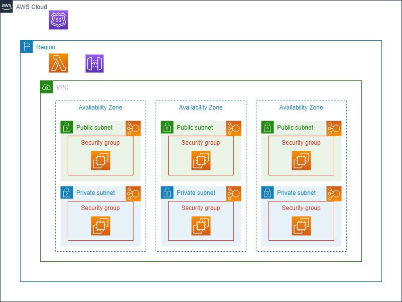

# AWS VPC setup using Terraform



 - Creates a single VPC with a public and private subnet in each availability zone in the eu-west-2 region.
 - Creates a VPC internet gateway and (an eip/nat gateway) swapped out for nat instance to save money for each availability zone in the eu-west-2 region.
 - Creates a single public route table and associates the public subnet of each availability zone in the eu-west-2 region.
 - Creates multiple private route tables and associates the private subnet of each availability zone in the eu-west-2 region.
 - Creates a route to the VPC internet gateway on the single public route table.
 - Creates a route to the availablity zone nat gateway on each of the private route tables.
 - Creates a public network ACL and associates the public subnet of each availability zone in the eu-west-2 region.
 - Creates a private network ACL and associates the private subnet of each availability zone in the eu-west-2 region.
 - Creates ingress/egress on the public and private network ACLs to allow all traffic/ports.
 - Creates a public security group and private security group.
 - Creates an Amazon Linux EC2 instance with 10 GB std EBS volume in the public and private subnet of each availability zone in the eu-west-2 region.
 - Creates an http server in each of the EC2 instances using EC2 user data script
 - Creates a public and private NLB with a TCP port 80 listener and target group using the EC2 instances.
 - Creates an api gateway with a lambda proxy integration.
 - Create an SNS topic with an SQS endpoint queue.
 - Associates the public and private security groups to the EC2 instances.
 - Creates a VPC endpoint gateway to S3 in the eu-west-2 region and adds a route to the private subnet route tables.

```bash
cd ~\terraform\account\lab\vpc
terraform init
terraform apply --auto-approve
```

To access the EC2 instances (bastion hosts) in the Public subnets and jump to the EC2 instances in the Private subnets, you need to do the following:

 1. We need to create a new key-pair and load the public key into the EC2 instance. The quickest way is to destroy and apply.

```bash
terraform destroy --auto-approve
ssh-keygen $home\.ssh\id_rsa
```
 1. Change the permissions on $home\\.ssh\id_rsa and $home\.ssh\id_rsa.pub so you are the owner with read access
 2. Start the ssh-agent service.
```bash
ssh-add -k $home\.ssh\id_rsa
```
 3. Copy the contents of $home\\.ssh\id_rsa.pub to ~\terraform\modules\base\ec2\ec2.tf aws_key_pair resource public_key.
```bash
terraform apply --auto-approve
```
You can now connect to the Public EC2 instances. You will need to grab the Public IP of the EC2 instance you want to connect to.
```bash
ssh -A ec2-user@XXXXXXXXX.eu-west-2.compute.amazonaws.com
```